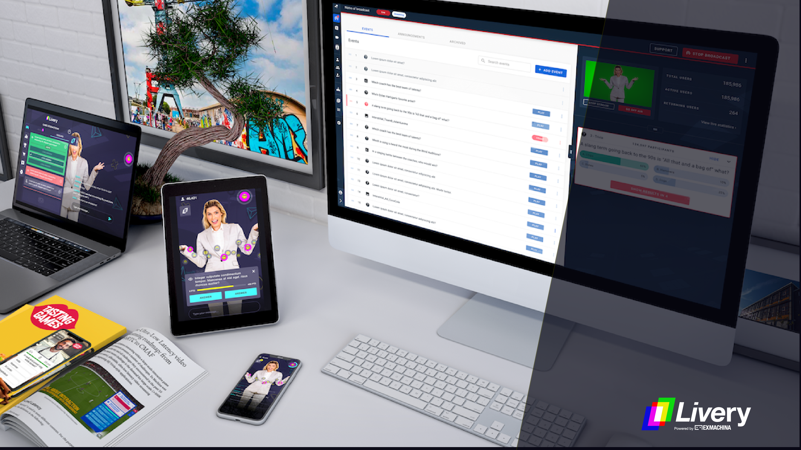

# Livery Video Docs

Livery offers a complete, end-to-end interactive live streaming solution.

The Livery player is the best way to bring low-latency interactive video project to your end users. Our player SDK’s can be integrated on iOS, Android and web in a matter of minutes. The built-in interactive layer in combination with our interaction engine (or you own) brings true interactive video within everyone’s reach. All managed via an easy-to-use online portal.

The following documentation helps you to get up-and-running with different components of the Livery platform.

?> Please find links to documentation of our SDKs and other components in the sidebar.

More information can be found at: [liveryvideo.com](https://liveryvideo.com).

For support questions please contact us via email or phone:

 
 

## Requirements

The following list contains a number of important requirements for the usages of the Livery platform.

### Connection Speed

It is recommended to use an internet connection which has at least twice the speed of the total bitrate that is going to be streamed as upload speed. For example if you have a 5Mbit and a 1Mbit video quality with a 96Kbit audio quality you would need an internet connection with an upload speed of at least 12.2Mbit. This extra internet speed is needed to be able to cope with fluctuations in the internet connection.

### Data Usages

When users view a stream, data is used. The following calculation shows the expected data consumption for a 1 hour stream. This is an indication, the actual data usages is slightly higher due to additional overhead (analytics, audio, config, ect).

**_((Bitrate / 8) * 60) * duration in minutes_**

- 0.8 mbps = 0.360 gigabyte (360 megabyte)
- 1.5 mbps = 0.675 gigabyte (675 megabyte)
- 3 mbps = 1.35 gigabyte (1,350 megabyte)
- 5 mbps = 2.25 gigabyte (2,250 megabyte)

### Browser and OS Support

The Livery players (iOS, Android and Web). Are tested on the 2 latest major OS and browser versions (iOS, Android, Chrome, Safari, Edge, Firefox, Android Chrome and Samsung Internet.). Lower versions are not officially supported.

### Domain Whitelisting

The Livery players connect with the following domains. The domains need to be whitelisted for the best possible user experience. All requests are done over HTTPS.

#### Generic

- time.akamai.com
- cdn.liveryvideo.com
- ip.liveryvideo.com

#### When using unpkg

- unpkg.com

#### When using embed

- embed.liveryvideo.com
- unpkg.com

#### Region dependent

##### Europe

- livery-ull-test.akamaized.net

##### South America

- livery-sa2.akamaized.net

##### United States of America General

- livery-us.akamaized.net

##### United States of America East Cost

- livery-us-east.akamaized.net

##### Asia Pacific and Japan

- livery-apj.akamaized.net

#### RTMP/SRT

- ingest.liveryvideo.com

#### Portal

- video-encoder-director.playtotv.com
- maps.googleapis.com
- maps.gstatic.com
- fonts.gstatic.com
- fonts.googleapis.com
- director.video-encoder.playtotv.com
- sentry.io

### Port configuration

The hardware encoder needs to communicate over the internet so send out metrics and allow remote diagnosis. For this it’s required that the encoder can make outbound connections on port 443 and port 22. Please make sure to open up these 2 ports if the encoder is deployed in an environment with a firewall. In order to stream to the cloud encoder one of these ports needs to be open for outbound connections. When using RTMP, port 1935 should be opened. When using SRT, port 9998 should be opened.

### Proxy

Some viewers view the stream via a (corporate) proxy. The Livery video solution uses HTTP/1.1 Chunked transfer encoding. Most proxies do not have a limitation for HTTP/1.1 traffic, allowing our stream to function. Proxies accommodate the option to set additional rules about data usages, domains, ports, ect. The additional rules might have an impact on the performance of the stream. A proxy needs to be ready for high amounts of data, especially with multiple viewers. 2.500 mbps of data passesthrough a proxy when 500 viewers watch a 5 mbps stream.
