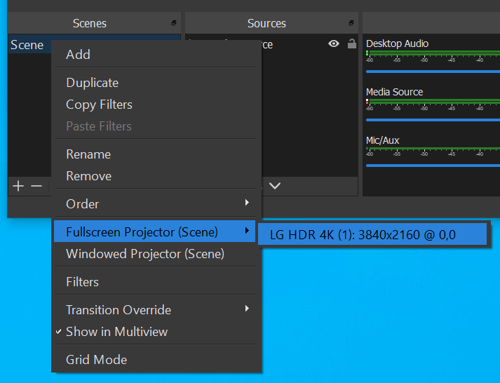
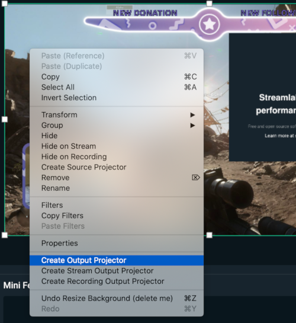
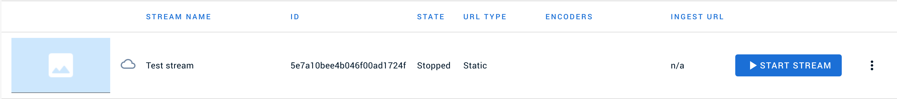
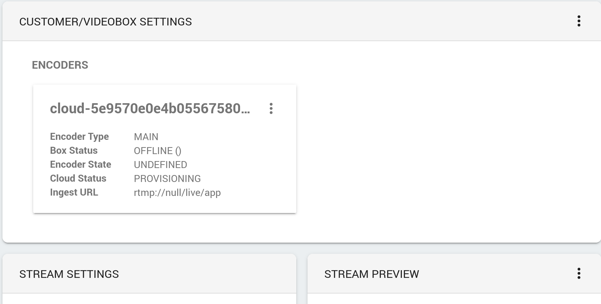
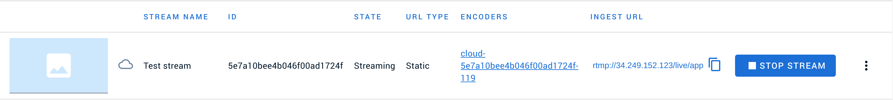
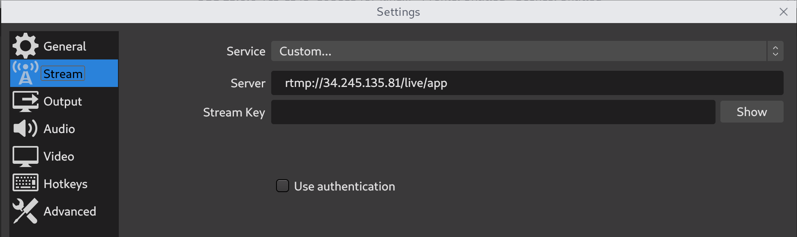
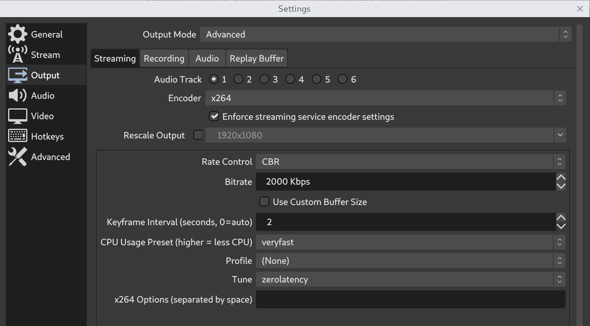
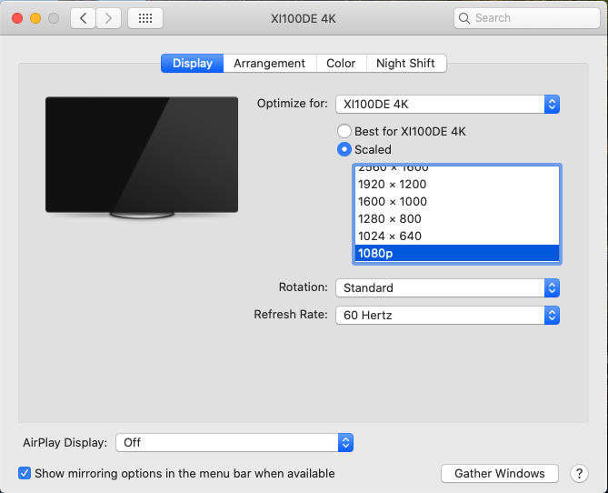
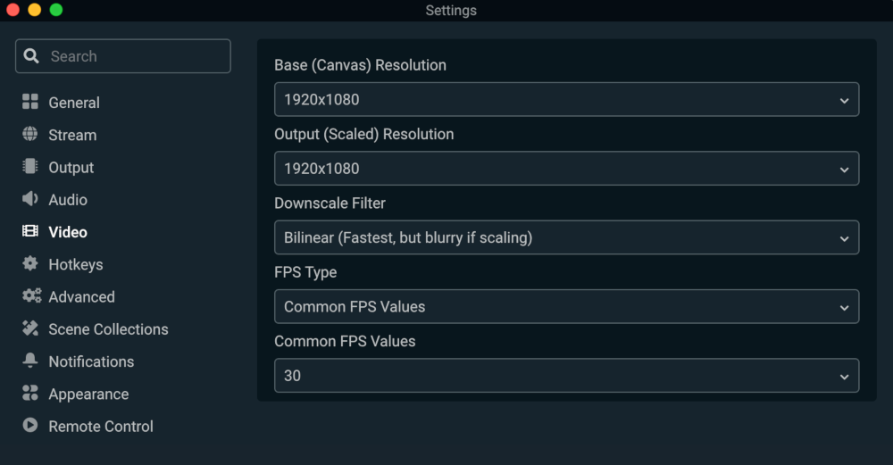

# Encoder

## Hardware encoder

### Input signal

Livery provides hardware encoders with two types of input connectors.
The input specifications for both encoders are as follows.

SDI

- Integrated cable equalizer supporting cable lengths up to 230M for HD signals
- Support for SD/HD/3Ga/3Gb/3Gb-DL/3Gb-DS standards
- Support for RGB 444, YCbCr 444, YCbCr 422 color sampling
- Support resolutions up to 1080P. Please contact us for information about higher resolutions on SDI.
- Support for capture frame rates up to 144fps (Actual capture frame rate can be limited by the image resolution)

HDMI

- 297MHz HDMI receiver
- Adaptive HDMI equalizer
- Support for RGB/YUV 444 8-bit format signals with a pixel frequency of no more than 297MHz
- Support for YUV 422 12-bit format signals with a pixel frequency of no more than 297MHz
- Support for RGB/YUV 444 10/12-bit format signals with a pixel frequency of no more than 170MHz
- Support resolutions up to 4K (4096x2160).
- Support for capture frame rates up to 144fps (Actual capture frame rate can be limited by the image resolution)

### Mixing software

There are some things to consider when using a hardware encoder in combination with video mixing software on a computer. The encoder will be assigned as an external monitor for the computer. The mixing software has to be setup in such a way that it outputs the video and audio to the external monitor. See examples of how this is set up in some mixers:
<!-- tabs:start -->
#### ** OBS **

#### ** Streamlabs OBS **

Choose matching output resolution

#### ** Wirecast **
TBD
<!-- tabs:end -->

Make sure you do this on the scene and not on one of the sources within your scene. Otherwise you will only see the selected source being sent to the encoder.

## Cloud encoder

### Livery Console

The cloud encoder can be controlled from the Livery console. After pressing the `start stream` button a cloud encoder will be provisioned.

This will take some time. In the `encoders` section a new encoder is added which will show PROVISIONING as the `encoder state`.

After the encoder is fully provisioned the state will change to PROVISIONED.

Notice the Ingest URL. Once the encoder is fully provisioned this URL can be copy/pasted into the streaming software (OBS/Wirecast/etc.).

### Input signal

The cloud encoder currently expects a resolution of 1920x1080. It can receive this input signal over RTMP. The URL that is used for RTMP can be found in the [Livery console](#Livery-Console). The encoder does not support a stream key or authentication. For the mixing software, see the RTMP URL stream and output settings (contact us if your prefered streaming software is not included):

<!-- tabs:start -->

#### ** OBS **

Note that the rtmp url is an example!

Sending the video to the cloud encoder adds a bit of latency. In OBS there is a setting for x264 called Tune=zerolatency that helps lowering this latency:

#### ** Streamlabs OBS **

Note that the rtmp url is an example!

Sending the video to the cloud encoder adds a bit of latency. In Streamlabs OBS there is a setting for x264 called Tune=zerolatency that helps lowering this latency:

#### ** Wirecast **

Wirecast

<!-- tabs:end -->

## Image settings

### Cropping

The livery encoder can crop the video that it is receiving before it encodes the video. This is useful when the video stream is used in a portrait mode app. If we would not crop the image the video player will receive the full landscape image and has to crop it in order to not show black bars above and below the video. While this will also work it means that a lot of the streamed pixels are discarded by the video player. This is a waste of bandwidth.

Cropping on the encoder works as follows. The encoder uses the output resolution aspect ratio to determine the size of the cropping area. We can provide a position from where to do the cropping. Usually this will be either at the complete left or exactly centered. This is an example for a portrait stream with a 9:16 aspect ratio. The input resolution is 1920x1080 and we have set the encoder to do centered cropping.

The yellow plane is the input image and the blue plane is the part of that image that the encoder will use. The encoder will use a plane of 603 pixels wide and 1072 pixels in height. It takes this weird nr of pixels to get a perfect aspect ratio of 9/16.

### Resolution and refresh rate

If a computer is used as the video source there are usually 2 places where we have to set the resolution and refresh rate. In order to achieve the best possible image quality these settings must match the encoder settings (or the other way around). The first place is the monitor settings and the second place is the mixing software settings. Let's say we want to stream a landscape video in 16/9 format where the highest quality we want to stream is 1080P/30FPS. If possible the framerate should be 30FPS or exactly double the target framerate. So 60FPS in this case. On Windows we can change the display settings like this:

Make sure to also check the `Advanced display settings` to make sure Active signal resolution is set correctly.

On macOS open `Displays` to alter the settings. Use the `Gather Windows` button to see the settings window of both monitor outputs. For the 1080P/30FPS we could set it up like this:

Next is the mixing software. See how to set the rendering resolution:

<!-- tabs:start -->
#### ** OBS **

#### ** Streamlabs OBS **

#### ** Wirecast **
<!-- tabs:end -->

## Network

It is recommended to use an internet connection which has at least twice the speed of the total bitrate that is going to be streamed as upload speed. For example if you have a 5Mbit and a 1Mbit video quality with a 96Kbit audio quality you would need an internet connection with an upload speed of at least 12.2Mbit. This extra internet speed is needed to be able to cope with fluctuations in the internet connection.