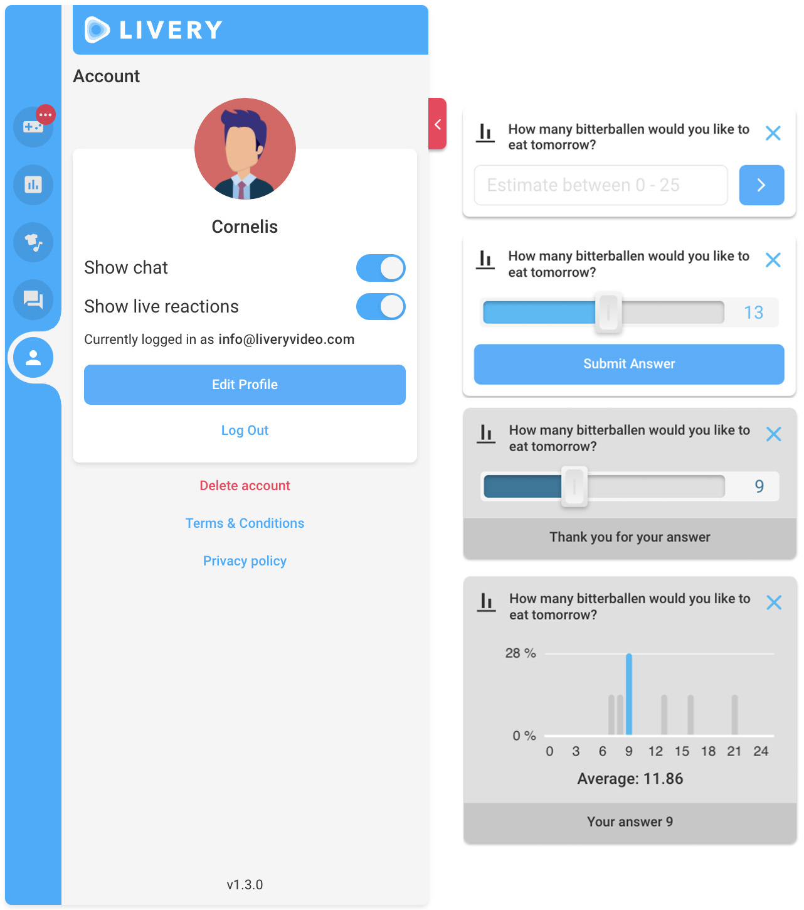
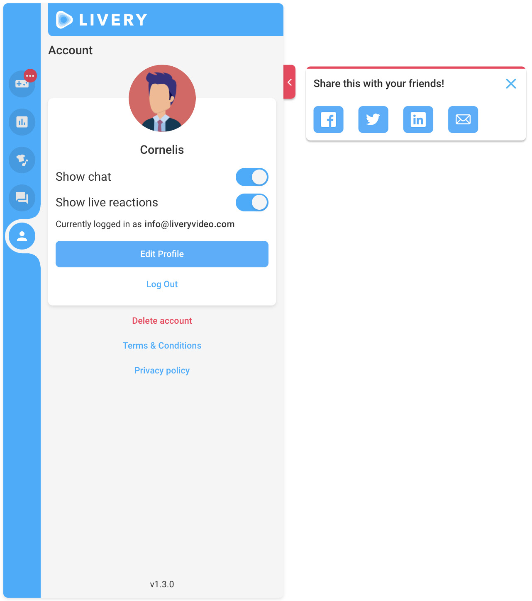
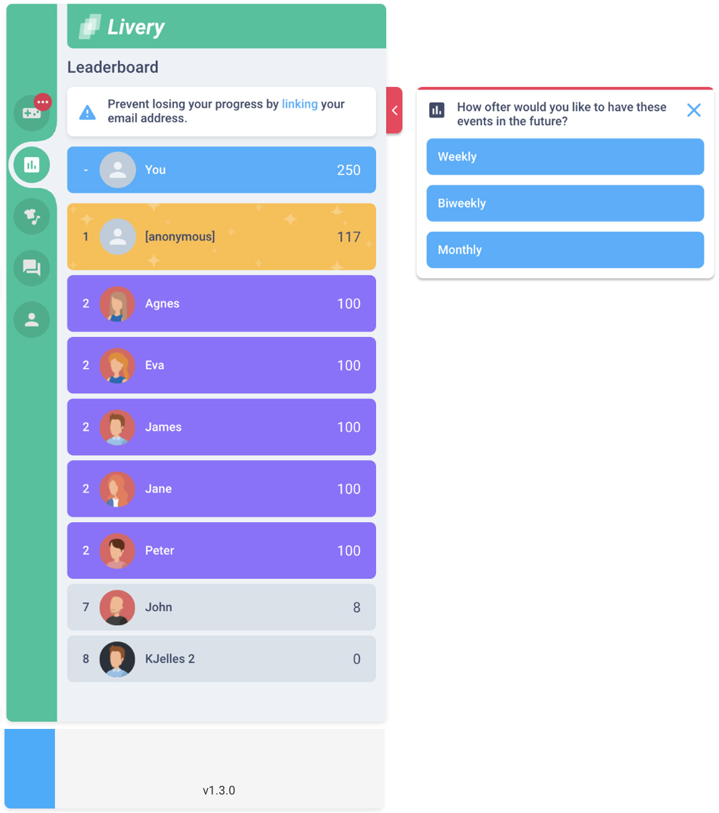
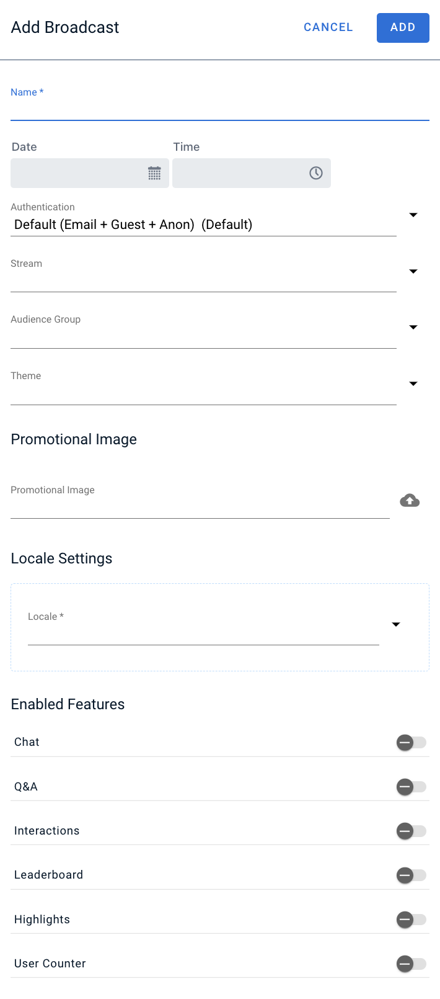
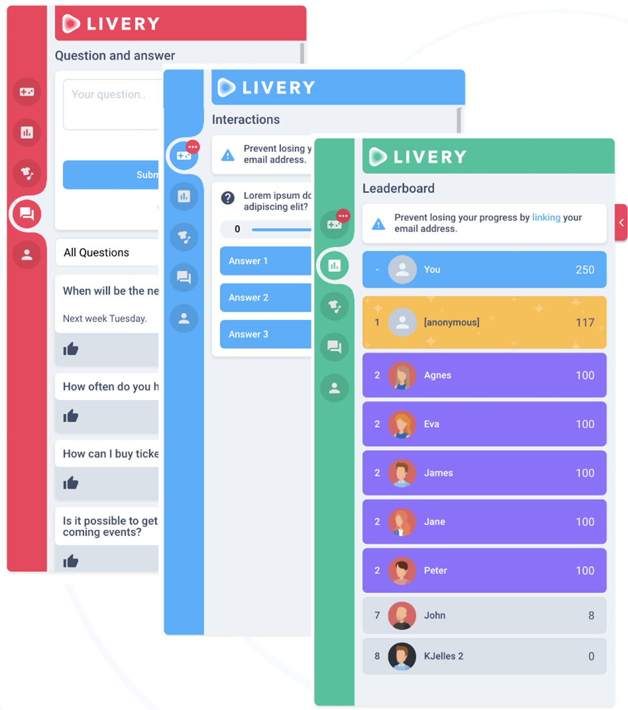
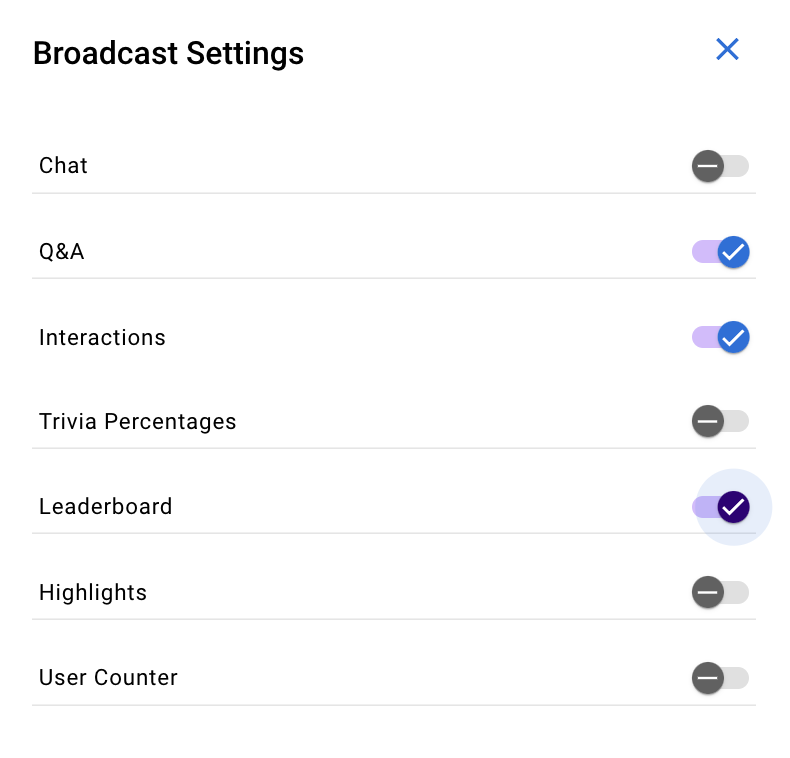
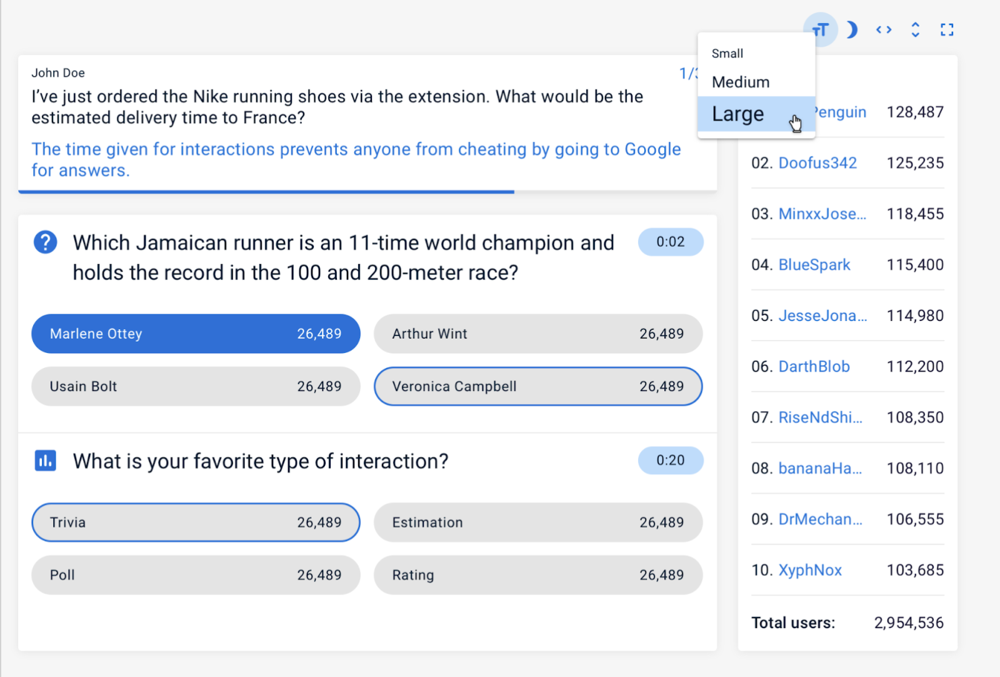

# Interactive Portal

Livery Interactive is a cloud based solution which brings true, interactive video within everyone’s reach on web, iOS and android devices. The responsive design ensures that on all devices you can enjoy the same experience.
With our product we provide you a fun and interactive way to enrich your broadcast event and at the same time create engaging experiences that are in perfect sync with the video.
Livery Interactive and Livery Video offered together but both parts of our product can be used separately as well.

On top of the video player sits the interactive layer, this is where your audience will see all interactions when they join your live broadcast event. You can plan, build and play all interactions in an intuitive web-based management system, designed to ensure that even one person can easily manage the elements of your broadcast but it is also supported to let multiple operators work together.

All important video management features are available within the web-based management system to provide an interface where both parts of the Livery product can be managed together.

Within Livery interactive the broadcast is the grouping entity of all the settings and interactions that you’d like to display to your audience during your broadcast event.
The interactions can have the following phases, all managed by the operators in the web-based management system:

- New: a new interaction in the timeline, still editable, not visible for the audience
- Open: the interaction has been played and showed to the audience, the end-users can interact
- Pending: the interaction is closed, end-users can no longer interact with it but the results are not yet published
- Closed: the interaction is closed, the end-users can no longer interact and the results are published

Interactions are grouped into the following packs:

### Core pack

Within this pack we include all the essentials, these are Poll, Vote, Trivia and Rating questions, showing Announcements, adding live reactions and the countdown.

#### Poll and Vote

The poll interaction is meant to prepare poll or vote questions with one question and multiple answers. Points are not added to these questions.

Key features:

- Up to 4 answers to the questions
- Time limit for answers

#### Trivia

The trivia interaction is meant to prepare trivia questions with one question and multiple answers where the correct answer(s) are marked. Eventual points will be calculated based on the player’s answers and optionally the time of answer, and these points will affect their position in the leaderboard.

Key features:

- Up to 4 answers to the questions
- Optional time limit for answers
- Optionally attached points
- Leaderboard results
- Showing percentage of provided answers
- Option for auto or manual closing of the results

#### Estimation poll

The estimation poll interaction is meant to prepare questions with answers within an interval. Scores are not added, this interaction provides the poll/vote result on a column chart including the average of given answers.

Key features:

- Slider or free value input
- Thank you message
- Column diagram of result
- Delayed result presentation

#### Rating

When you’d like to ask the opinion of your audience about a certain topic, you can set up a rating interaction.

Key features:

- Attached image
- Rating result override

#### Announcement

The announcement interaction is meant to prepare quick announcements with title and subtitle. This is shown only one time in the front-end, after the interaction disappears and can't be rewatched.

Key features:

- Quick announcement
- Option for auto or manual closing

#### Live reaction

To offer the option to express feelings during the broadcast these live reaction emojis can be shown.

Key features:

- Up to 6 emojis in the selector
- Predefined emoji list in the web-based management system
- Unlimited reactions during broadcast

#### Countdown

The countdown indicates how much time is left before the broadcast event is starting. It shows days, hours, minutes and seconds.

Key features:

- Data and time selector in the web-based management system
- Audience can already interact before the time is up
- Configurable title
- Configurable message for the last 60 seconds

### Communication pack

This pack provides you the chat functionality and the Q&A feature which can be moderated via the web-based management system.

#### Chat

The audience can chat with each other via the chat module.

Key features:

- Rate limit to avoid spamming
- Enable/disable chat in the web-based management system

#### Q&A

When the Q&A session is open the audience has the option to raise questions which the operator can manage in the web-based management system.

Key features:

- Approve, answer options of questions
- Show/hide in Client and/or Presenter view
- Rate limit on question submission (avoid spamming)
- Pinning
- Filtering
- Search

#### Social share

With the social share interaction you can encourage your audience to share a short message on social platforms.

Key features:

- Predefined message
- Native share functionality on mobile devices
- Selected sharing platforms on desktop
- Option for auto or manual closing

### Gamification pack

If you run a competition or would like to give prizes to your audience, this pack is what you need. It includes new interactions like estimation and prediction which are ideal for gamification. Additionally, the leaderboard lets users check their points and compare themselves against the top points.
So the flow is pretty simple, you assign points to the Trivia, Estimation and Prediction interaction, the players will earn points based on their correct answers, their points are ranked on the leaderboard and based on their positions they can win prizes. It couldn’t be easier!

#### Estimation

The estimation interaction is meant to prepare questions with answers within an interval. Points will be calculated based on the player’s answers and these points will affect their position in the leaderboard.

Key features:

- Slider or free value input
- Score deduction per steps

#### Prediction

The prediction interaction is meant to prepare questions with one question and multiple answers where the correct answer(s) are not known. Points will be calculated based on the player’s answers and these points will affect their position in the Leaderboard.

Key features:

- Up to 4 answers to the questions
- Time limit for answers
- Attached points
- Leaderboard results

#### Leaderboard

The Leaderboard shows the earned points of the players during the broadcast.

Key features:

- Actual user is always in the top
- Top positions are highlighted

### Commerce pack

To support monetisation, we include elements that offer e-commerce capabilities. With these you can link your audience to your e-commerce platform or webshop to browse, configure, rate and buy your products.

#### Product item

For product promotions the product item interaction can be used.

Key features:

- Discount price
- Attached rating
- Multiple attributes (size, color, etc.)
- Copy change of the Buy button

#### Announcement

The announcement interaction is meant to prepare quick announcements with title, subtitle and a button. This is shown only one time in the front-end, after the interaction disappears and can't be rewatched.

Key features:

- Quick announcement
- Adding external link
- Option for auto or manual closing

#### Rating

When you’d like to ask the opinion of your audience about a certain topic, you can set up a Rating interaction. It is also possible to link this rating to one of the items in the Items page (product items) and the result will be then also visible in the details page of this certain item.

Key features:

- Linked product item
- Attached image
- Rating result override

### Management features

These powerful management features give you the opportunity to configure your broadcast, target it for your audience and provide you data and analytics to make your broadcast event even better.
The features are Broadcast management, Account management, Currency handling, Theming, Audiences, Show/Hide pages or features, Presenter view and Data export. All these management features, real-time interaction results and analytics are provided by our web-based management system.

#### Broadcast management

Broadcast is the main grouping element within our system.
For every broadcast event you set up a broadcast within the web-based management system where you define the details above..
Once you have a broadcast defined, you can start to add interactions to it to fill up your timeline.

| Field               | Description                                                                          |
| ------------------- | ------------------------------------------------------------------------------------ |
| Name                | The name of the broadcast                                                            |
| Start date and time | The planned “Date” and “Time” of the broadcast                                       |
| Authentication      | The list of available authentication templates                                       |
| Promotional image   | A banner to show to the audience in the interactive layer                            |
| Stream              | The list of available stream in case Livery Video is configured                      |
| Audience group      | In case of closed broadcast the list of emails who can participate in the event      |
| Theme               | The selected branding of the interactive layer                                       |
| Locale              | The locale which defines how the currencies, amounts and date/time will be formatted |
| Enabled features    | All the features and pages which you’d like to show to your audience                 |

The web-based management system allows you to manage your broadcasts and get an overview of your previous items.

Key features:

- Select authentication method
- Add promotional image to your broadcast (banner)
- Select your locale
- Start/stop your broadcast anytime you want
- Select a theme for your branding
- Add audience group for closed broadcasts
- Show/Hide features and pages
- Video Stream selection

#### Account management

Interactions can be seen anonymously but to earn points, use the chat or Q&A features the players need to log in or set up a guest user.

Key features:

- Nice choice of avatars
- Verification code for logging in
- Logged in or guest users can be removed
- Leaderboard results are attached to logged in users
- Show/Hide live reactions
- Show/Hide chat
- Disclaimers based on the authentication template

#### Currency handling

The Broadcast’s locale can be selected on the Broadcast;s form. This will define how currencies, amounts, date/time format will be shown on the front end.

Key features:

- Predefined list (easy adjustment)
- Preview of values

#### Theming

The look and feel of the Interactivity can be defined via Themes. The web-based management system offers an easy to use way to change colours and logos easily.

Key features:

- 5 colors, 2 logos and 1 style generates a new look
- Default theme setup (on customer level)
- Theme definition on broadcast level

#### Audience groups

With audience groups you can set up a broadcast which is available for only a closed group of users.

Key features:

- Audience group management in the web-based management system
- Individual emails or full domains can be included
- Exclude guest user option

#### Show/Hide pages or features

You can select which pages and features you’d like to add to your broadcast out of the list of:
- Chat
- Q&A
- Interactions
- Leaderboard
- Highlights (product items)
- Showing percentage of provided answers

#### Presenter view

During the broadcast event the Presenter can check the interaction results, live reaction activity or the raised Q&A questions on this dedicated page.

Key features:

- Without clicking the content can be seen
- Automated timer for scrolling the content
- Flipping screen horizontally or vertically
- Full screen option
- Font size setup
- Leaderboard top 10

#### Data export

During the broadcast event we collect information about user’s reactions and actions,. This data can be downloaded via the web-based management system, structured into the following reports:

- Broadcast data
- User information including leaderboard ranking and earned points
- Chat messages
- Q&A questions and answers
- Poll, Trivia, Prediction interaction data
- Estimate interaction data
- Rating results

#### Livery Video Integration - Video Stream Control

The most important Video stream settings and management is available via the web-based management system, so everything can be set up in one place end to end.

#### Google Analytics integration

To collect analytical data, Livery supports Google Analytics integration.

#### Interaction API

When you’d like to access the statistics of the interactive layer, you can use our Interaction API and with the available data build your overview.

### Revision History

| Version                                        | Description                                                                                                                                                                                                                                                                                                                                                             |
| ---------------------------------------------- | ----------------------------------------------------------------------------------------------------------------------------------------------------------------------------------------------------------------------------------------------------------------------------------------------------------------------------------------------------------------------- |
| Client: 1.6.3 Server: 1.16.0 CMS: 2.2.1  | - CMS feedback form - Export/Import of Themes and Audience groups - Search on Audience groups - Toast message for data exports - Add participant number to Estimation poll details - Client localisation updates                                                                                                                                      |
| Client: 1.6.1 Server: 1.15.0 CMS: 2.0.0  | - Estimation poll with phase setup                                                                                                                                                                                                                                                                                                                                   |
| Client: 1.5.4 Server: 1.11.3 CMS: 1.10.1 | - Restricted API (user, leaderboard, broadcast, interaction and all data) - Unverified frictionless login - CMS Settings page - Auto-close for Trivia results - Leave popout open after answering - StreamKey is shown in the Ingest dialog - Q&A improvements - Close drawer for returning users after verification - Rate limiter on chat  |
