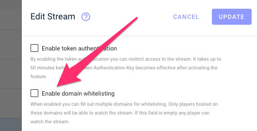
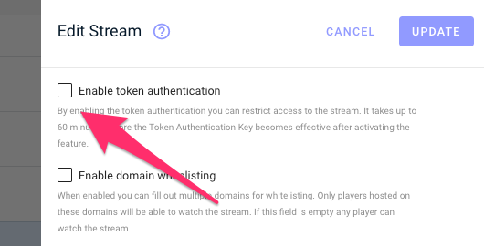
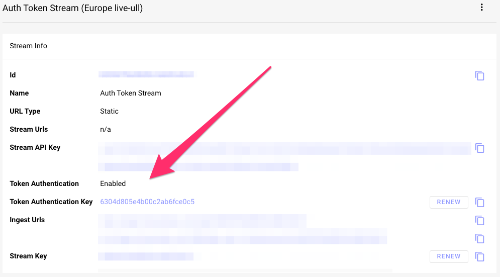
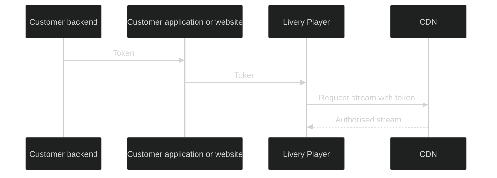
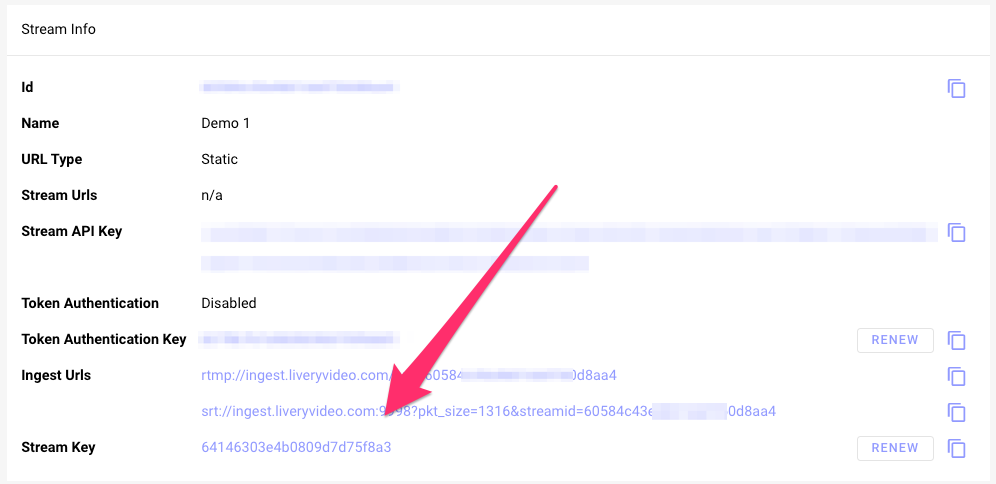

# Security

Security is an essential aspect of live streaming, and Livery strives to ensure the utmost safety of your interactive live streams. In addition to our general security measures, Livery provides supplementary security features that can be configured through Livery's online portal(s).

## Domain whitelisting

By enabling domain-level privacy, customers can specify the websites that are authorized to integrate or embed the Livery video player. Any sites not included on the list will receive an error message when attempting to play the stream. The domain whitelisting feature can be accessed through the 'Stream Settings'.

This feature allows the whitelisting of one or more domains. If the domain list is empty, any player will be able to play the stream. Please note that changes made to the domain whitelisting can take up to 4 hours to become active.

When a viewer attempts to play the stream, the browser will verify if the underlying domain matches any of the domains on the list. Please be aware that subdomains must be added separately, as adding the main domain will not cover them. Additionally, the use of wildcard characters is supported

## Token Authentication

Secure session tokens are utilized to authenticate user sessions and prevent unauthorized sharing of the streaming URL. Token-based authentication mechanisms are widely used across the Internet to verify user rights and enhance security.

This feature employs tokens that are generated using a "trusted shared secret". This secret is shared between the customer and the CDN.

Token Authentication security ensures that the stream is delivered only to the authenticated user, thus preventing link sharing and player hijacking attacks.

### Enable Token Authentication

Token Authentication can be enabled via the checkbox in the ‘Stream Settings’. When enabled the Livery backend generates a Token Authentication Key for each stream, which is automatically added to the configuration of the CDN.

The ‘Token Authentication Key’ is listed on the ‘Stream Details’ accessible via the portal.

The customer backend determines which users, logged in to the customer website, have access to the video stream. The customer backend generates tokens for these users using one of [Akamai's Token Auth software development kits (SDKs)](https://techdocs.akamai.com/adaptive-media-delivery/docs/generate-a-token-and-apply-it-to-content). The Akamai documentation explains how they use long and short tokens. With Livery we use a advanced version of Token Authentication which only uses long tokens. This allows you to deny access to users without having to wait 24 hours, which would be the case when using the traditional setup.

To generate the tokens, the backend needs the Token Authentication Key, which can be copied from the ‘Stream Detail’ page in the Livery Portal. The customer's backend then forwards these tokens to the customer application or website. When using one of the SDK's to generate a token, make sure to use these settings.

| Parameter  | Value                              |
| ---------- | ---------------------------------- |
| acl        | \*                                 |
| window     | The time the token should be valid |
| token_name | 'hdntl'                            |
| payload    | 'hdntl'                            |
| key        | The Token Authentication Key       |

The customer application or website opens the Livery native or web player, which has an attribute called 'akamailongtoken'. This attribute can be set to the token retrieved from the customer backend.

The Livery player forwards the token to CDN when fetching the video data. Once the token expires, a new token needs to be provided from the customer application or website for the Livery player to authenticate with CDN again.

## Stream Key

The Livery platform utilizes an RTMP or SRT stream for the first mile delivery to the cloud encoder. To authenticate a live stream with the Livery Cloud encoder, a Stream Key is used. The key can be copied or regenerated via the ‘Stream Details’ page in the Livery portal.

The Stream Key in combination with the Stream URL (SRT/RTMP)can be copied to the prefered streaming tool. See [mixer soft- and hardware](https://docs.liveryvideo.com/video_ingest?id=mixer-soft-and-hardware) for more infomation about the tools.

## CDN Authentication

CDN authentication is utilized to secure the connection between the encoder (both cloud and on-premises) and the CDN. This prevents hackers from hijacking the stream. For each stream, unique credentials are used to upload videos to the CDN, and this is done automatically by the Livery platform without requiring any intervention from the user.
