# Livery Video Ingest

Video can be ingested via an encoder. Livery provides reliable encoder technology fully integrated in the Livery ecosystem. The Livery encoder is built from the ground up to provide the highest video quality with the lowest possible latency, all in perfect sync. Based on the needs and preferences, encoding can be handled an on-premise hardware encoder or our cloud encoder solution.

## Cloud encoder

### Input Signal

The cloud encoder currently expects a resolution of 1920x1080. It can receive this input signal over RTMP or SRT. The URL that is used for the video ingest can be found in the Livery console. The encoder does not support a stream key or authentication. For the mixing software, see the RTMP or SRT URL stream and output settings (contact us if your prefered streaming software is not included).

## On-prem encoder

The hardware encoder accepts a HDMI or SDI feed and uploads it to the CDN. The two most important benefits of this device over the cloud encoder are: The first is that the video only needs to be encoded once instead of twice. This means using the hardware encoder will result in better video quality. And the second is that the hardware encoder sends out metrics to our backend. This allows us to diagnose issues when they occur on the internet connection between the encoder and the CDN.

The hardware encoder needs to communicate over the internet so send out metrics and allow remote diagnosis. For this it’s required that the encoder can make outbound connections on port 443 and port 22. Please make sure to open up these 2 ports if the encoder is deployed in an environment with a firewall.

### Input signal

Livery provides hardware encoders with two types of input connectors. The input specifications for both encoders are as follows.

#### SDI

Integrated cable equalizer supporting cable lengths up to 230M for HD signals
Support for SD/HD/3Ga/3Gb/3Gb-DL/3Gb-DS standards
Support for RGB 444, YCbCr 444, YCbCr 422 color sampling
Support resolutions up to 1080P. Please contact us for information about higher resolutions on SDI.
Support for capture frame rates up to 144fps (Actual capture frame rate can be limited by the image resolution)

#### HDMI

- 297MHz HDMI receiver
- Adaptive HDMI equalizer
- Support for RGB/YUV 444 8-bit format signals with a pixel frequency of no more than 297MHz
- Support for YUV 422 12-bit format signals with a pixel frequency of no more than 297MHz
- Support for RGB/YUV 444 10/12-bit format signals with a pixel frequency of no more than 170MHz
- Support resolutions up to 4K (4096x2160).
- Support for capture frame rates up to 144fps (Actual capture frame rate can be limited by the image resolution)

There are some things to consider when using a hardware encoder in combination with video mixing software on a computer. The encoder will be assigned as an external monitor for the computer. The mixing software has to be setup in such a way that it outputs the video and audio to the external monitor.

## Multi audio output

Both Windows and Mac OS allow the play audio over multiple outputs at the same time, including audio received by a microphone.

On Windows this can be achieved by enabling “Stereo Mix” via the audio settings. Navigate to the audio icon in your system tray, right-click it, and select “Open Sound settings” and the “Sound Control Panel”.
Navigate to the “Recording” tab and make sure both “Show Disabled Devices” and “Show Disconnected Devices” options are checked. The “Stereo Mix” setting is now visible.

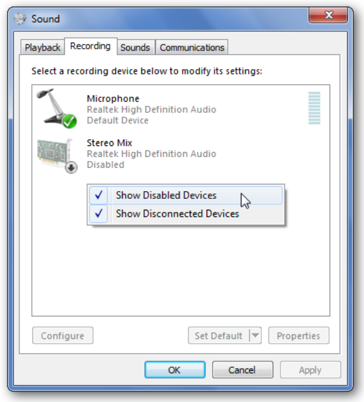

Right-click on “Stereo Mix” and click “Enable” to be able to use it and select “Properties”. In the “Listen” tab of the properties panel, the proper audio device can be selected.
On Mac OS this can be achieved by using the App "Audio MIDI Setup" in /Applications/Utilities. When opening the app, a list of all audio devices in the list to the left. With the "+" button at the bottom a new “Aggregate Device” or a “Multi-Output Device” can be added.

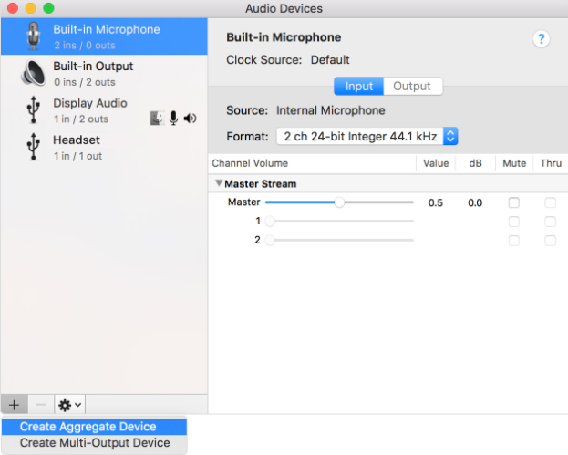

Check the required devices from the overview. The created device shows up as normal audio devices in the system preferences' "Sound" settings.

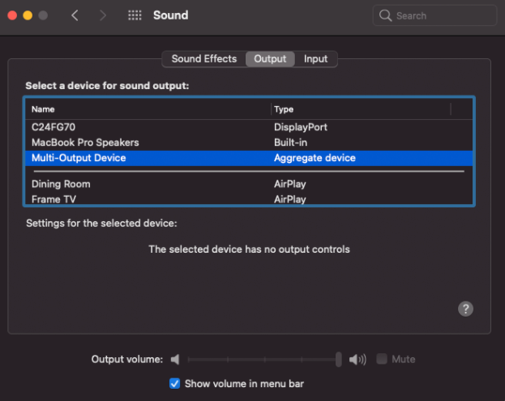

## Cropping

The livery encoder can crop the video that it is receiving before it encodes the video. This is useful when the video stream is used in a portrait mode app. If we would not crop the image the video player will receive the full landscape image and has to crop it in order to not show black bars above and below the video. While this will also work it means that a lot of the streamed pixels are discarded by the video player. This is a waste of bandwidth.

Cropping on the encoder works as follows. The encoder uses the output resolution aspect ratio to determine the size of the cropping area. We can provide a position from where to do the cropping. Usually this will be either at the complete left or exactly centered. This is an example for a portrait stream with a 9:16 aspect ratio. The input resolution is 1920x1080 and we have set the encoder to do centered cropping.

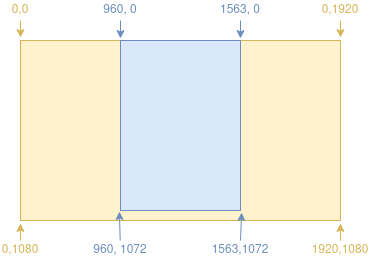

The yellow plane is the input image and the blue plane is the part of that image that the encoder will use. The encoder will use a plane of 603 pixels wide and 1072 pixels in height. It takes this weird nr of pixels to get a perfect aspect ratio of 9/16.

## Resolution and refresh rate

If a computer is used as the video source there are usually 2 places where we have to set the resolution and refresh rate. In order to achieve the best possible image quality these settings must match the encoder settings (or the other way around). The first place is the monitor settings and the second place is the mixing software settings. Let’s say we want to stream a landscape video in 16/9 format where the highest quality we want to stream is 1080P/30FPS. If possible the framerate should be 30FPS or exactly double the target framerate. So 60FPS in this case. On Windows we can change the display settings like this:

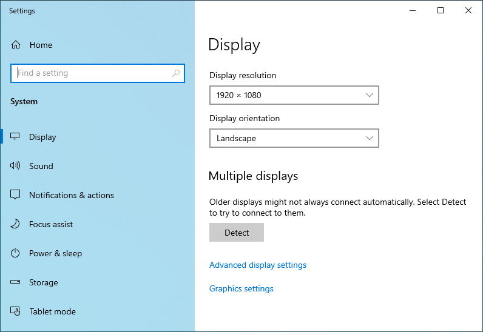

Make sure to also check the Advanced display settings to make sure Active signal resolution is set correctly.

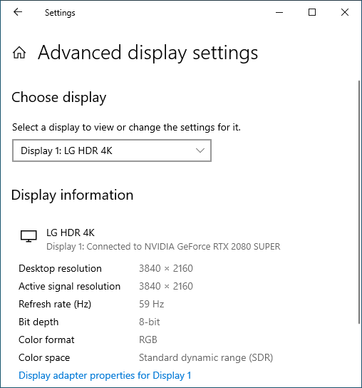

On macOS open Displays to alter the settings. Use the Gather Windows button to see the settings window of both monitor outputs. For the 1080P/30FPS we could set it up like this:

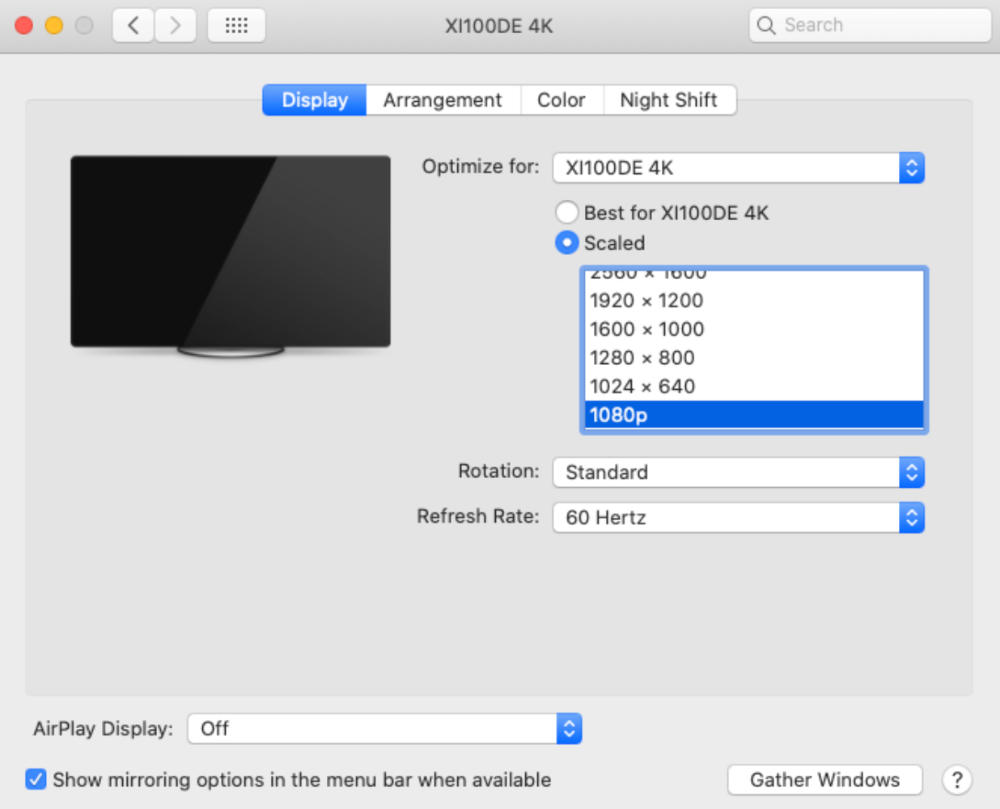

## Network

It is recommended to use an internet connection which has at least twice the speed of the total bitrate that is going to be streamed as upload speed. For example if you have a 5Mbit and a 1Mbit video quality with a 96Kbit audio quality you would need an internet connection with an upload speed of at least 12.2Mbit. This extra internet speed is needed to be able to cope with fluctuations in the internet connection.

## Mixer Soft- and Hardware

A soft- and or hardware mixer is often used to output one or more broadcast streams. All video sources are connected with the Mixer, from which the broadcast stream is ingested in either the Cloud or On-premis encoder.

The following overview contains an overview of the most common video mixing tools and the configuration needed live stream using Livery Video.

### OBS

?> <https://obsproject.com/nl>

<!-- tabs:start -->

#### **RTMP**

| Menu   | Item Property     | Value                                                                                                                       |
| ------ | ----------------- | --------------------------------------------------------------------------------------------------------------------------- |
| Stream | Service           | Custom                                                                                                                      |
|        | Server            | Ingest URL for example rtmp://ingest.liveryvideo.com/app/12a34b56c78d90e                                                    |
|        | Stream Key        | Stream Key optional value for example vYm5X669xxdk                                                                          |
| Output | Output Mode       | Advanced                                                                                                                    |
|        | Encoder           | x264                                                                                                                        |
|        | Rate Control      | CBR                                                                                                                         |
|        | Bitrate           | A higher value as the max bitrate configured in the Livery Encoder settings                                                 |
|        | Keyframe interval | Recommended setting is 2. The value should match the segment size set in the Livery Encoder settings                        |
|        | CPU Usages Preset | Veryfast                                                                                                                    |
|        | Tune              | Zerolatency                                                                                                                 |
| Video  | Output Resolution | 1920x1080px Please reachout to us when an alternative resolution is requested.                                              |
|        | Common FPS Values | 25 PAL It is strongly recommended to use the same FPS throughout the complete workflow, to prevent audio/video sync issues. |

#### **SRT**

| Menu   | Item Property     | Value                                                                                                                       |
| ------ | ----------------- | --------------------------------------------------------------------------------------------------------------------------- |
| Stream | Service           | Custom                                                                                                                      |
|        | Server            | Ingest URL for example srt://ingest.liveryvideo.com:9998?pkt_size=1316&streamid=12a34b56c78d90e                             |
|        | Stream Key        | Stream Key optional value for example vYm5X669xxdk                                                                          |
| Output | Output Mode       | Advanced                                                                                                                    |
|        | Encoder           | x264                                                                                                                        |
|        | Rate Control      | CBR                                                                                                                         |
|        | Bitrate           | A higher value as the max bitrate configured in the Livery Encoder settings                                                 |
|        | Keyframe interval | Recommended setting is 2. The value should match the segment size set in the Livery Encoder settings                        |
|        | CPU Usages Preset | Veryfast                                                                                                                    |
|        | Tune              | Zerolatency                                                                                                                 |
| Video  | Output Resolution | 1920x1080px Please reachout to us when an alternative resolution is requested.                                              |
|        | Common FPS Values | 25 PAL It is strongly recommended to use the same FPS throughout the complete workflow, to prevent audio/video sync issues. |

#### **On-prem**

Assign the on-prem encoder as an external monitor of the computer. Set OBS to Studio Mode, and select the encoder as the “Fullscreen Projector”.

#### **Screenshots**

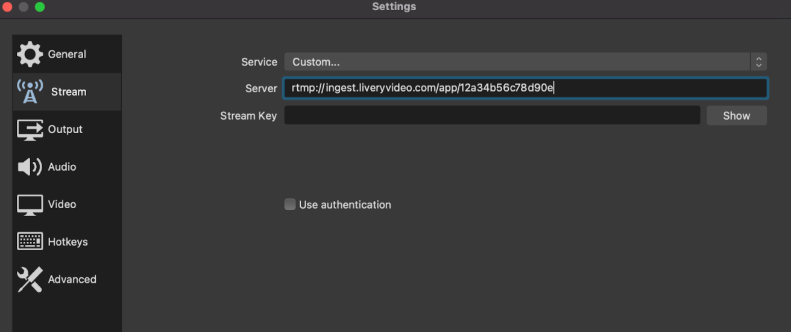

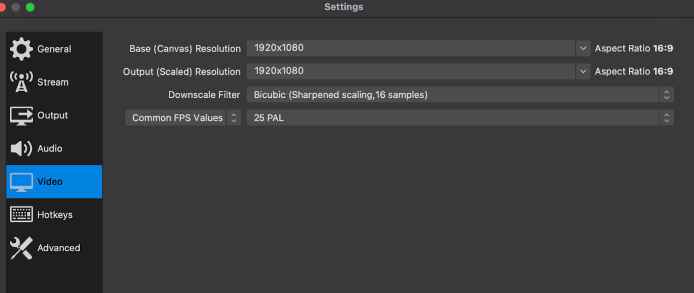

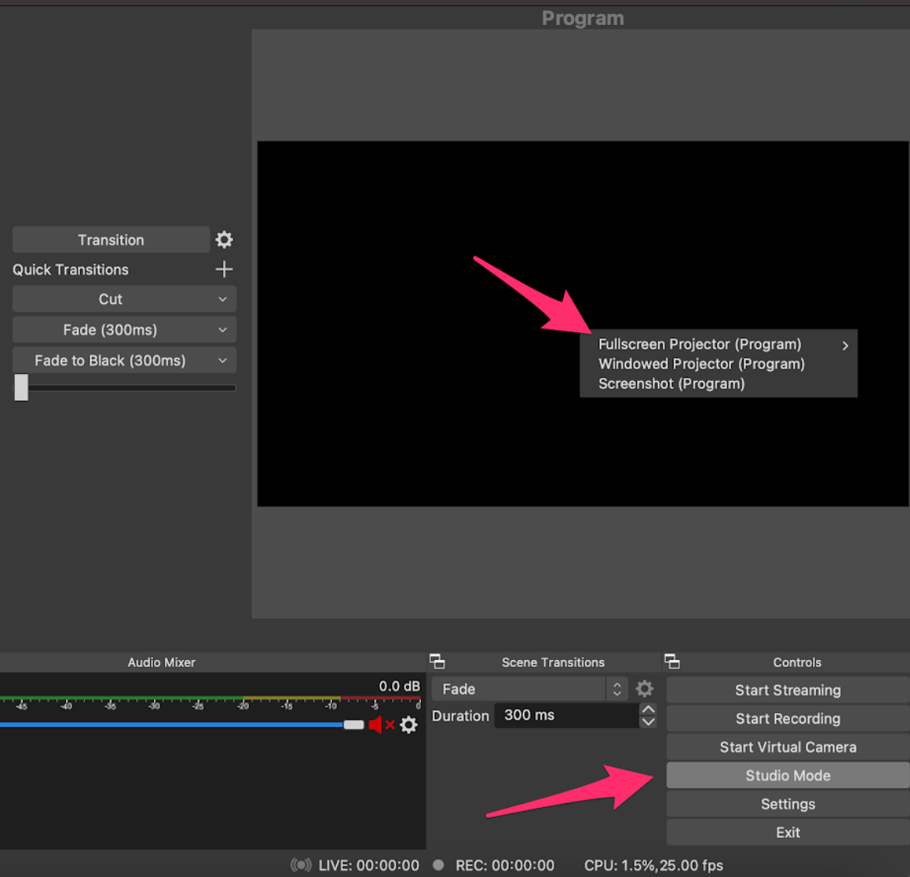

<!-- tabs:end -->

### vMixer

?> <https://www.vmix.com/>

<!-- tabs:start -->

#### **RTMP**

| Menu Item         | Property           | Value                                                                    |
| ----------------- | ------------------ | ------------------------------------------------------------------------ |
| Destination       | Service            | Custom                                                                   |
|                   | URL                | Ingest URL for example rtmp://ingest.liveryvideo.com/app/12a34b56c78d90e |
|                   | Stream Key         | Stream Key optional value for example vYm5X669xxdk                       |
|                   | Quality            | Custom via the gear icon                                                 |
| Streaming Quality | Encode Size        | 1920x1080                                                                |
|                   | Profile            | Main                                                                     |
|                   | Level              | 3.1                                                                      |
|                   | Preset             | Ultrafast                                                                |
|                   | Aspect Ratio/Crop  | Original                                                                 |
|                   | Keyframe Frequency | 2 seconds                                                                |
|                   | Network Buffer     | 5 Seconds                                                                |
|                   | Strict CBR         | Checked                                                                  |

#### **SRT**

SRT is supported via a workaround

| Menu Item         | Property           | Value                                                                    |
| ----------------- | ------------------ | ------------------------------------------------------------------------ |
| Destination       | Service            | Custom                                                                   |
|                   | URL                | Ingest URL for example rtmp://ingest.liveryvideo.com/app/12a34b56c78d90e |
|                   | Stream Key         | Stream Key optional value for example vYm5X669xxdk                       |
|                   | Quality            | Custom via the gear icon                                                 |
| Streaming Quality | Encode Size        | 1920x1080                                                                |
|                   | Profile            | Main                                                                     |
|                   | Level              | 3.1                                                                      |
|                   | Preset             | Ultrafast                                                                |
|                   | Aspect Ratio/Crop  | Original                                                                 |
|                   | Keyframe Frequency | 2 seconds                                                                |
|                   | Network Buffer     | 5 Seconds                                                                |
|                   | Strict CBR         | Checked                                                                  |

### **On-prem**

| Destination              | Service           | Custom                                                                       |
| ------------------------ | ----------------- | ---------------------------------------------------------------------------- |
| Windows Display settings | Multiple displays | Extend these displays                                                        |
| vMix Display settings    | Output Size       | 1920x1080                                                                    |
|                          | Display           | 2 (The display port used by the encoder)                                     |
| vMix Main screen         | Fullscreen        | Press Fullscreen to start outputting the video to the selected display port. |

### **Screenshots**

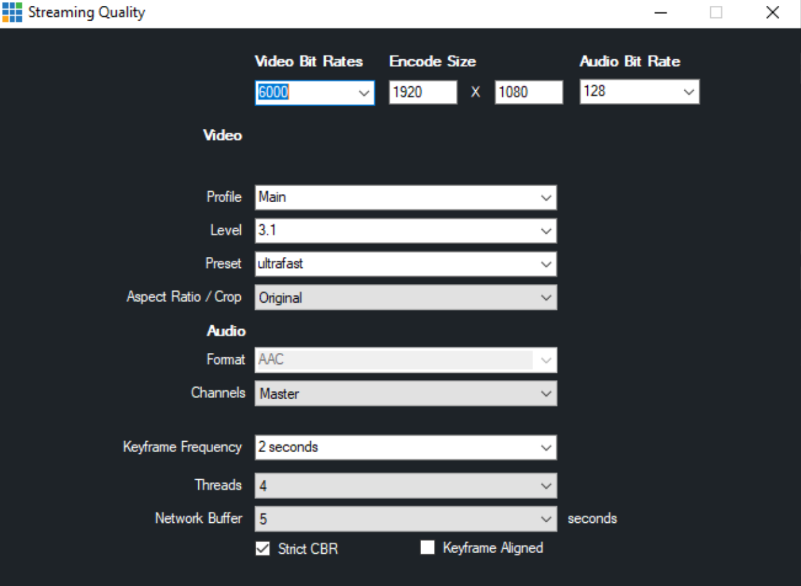

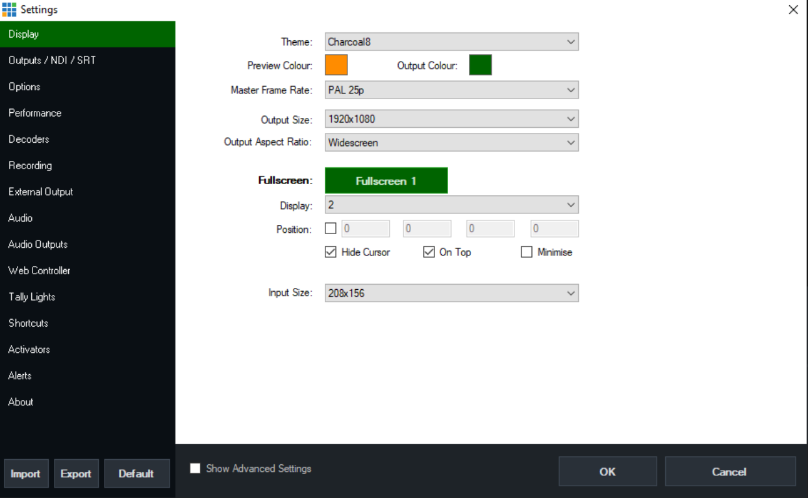

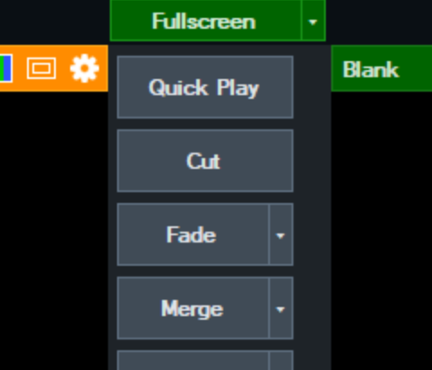

<!-- tabs:end -->

### StreamYard

?> <https://streamyard.com/>

?> A Professional Streamyard account is required to make the required changes to stream using the Livery platform.

?> SRT is not supported

<!-- tabs:start -->

#### **RTMP**

| Menu Item   | Property          | Value                                                                                                                                                    |
| ----------- | ----------------- | -------------------------------------------------------------------------------------------------------------------------------------------------------- |
| Destination | Service           | Custom                                                                                                                                                   |
|             | RTMP Server URL   | Streamyard requers the ingest URL and stream key to be separated. The stream ID should be removed from the Ingest URL rtmp://ingest.liveryvideo.com/app/ |
|             | Stream Key        | The Stream Key is a mandatory value in Streamyard, the last part if the stream ID can be added as Stream Key; 12a34b56c78d90e                            |
| Settings    | Broadcast Quality | 1080p                                                                                                                                                    |

#### **Screenshots**

<!-- tabs:end -->
### Re-stream.IO

?> <https://try.restream.io/>

?> SRT is not supported

?> On-Prem is not supported

<!-- tabs:start -->

#### **RTMP**

| Menu Item | Property          | Value                                                                    |
| --------- | ----------------- | ------------------------------------------------------------------------ |
| Channel   | Service           | Custom                                                                   |
|           | RTMP URL          | Ingest URL for example rtmp://ingest.liveryvideo.com/app/12a34b56c78d90e |
|           | Stream Key        | Stream Key optional value for example vYm5X669xxdk                       |
| Settings  | Broadcast Quality | 1080p                                                                    |

#### **Screenshots**

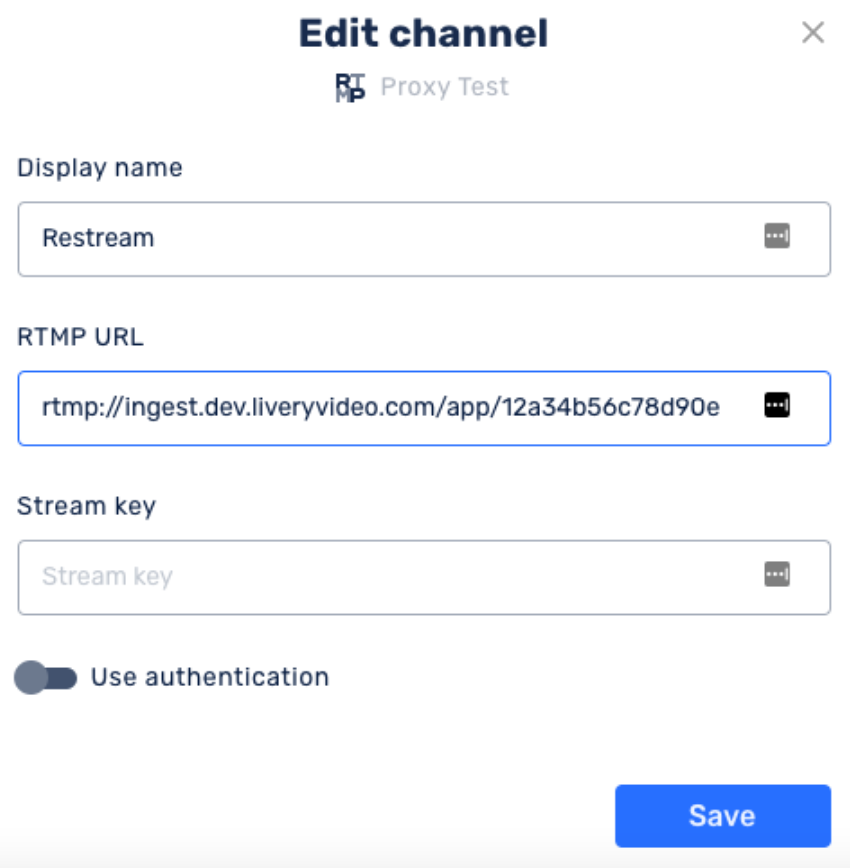

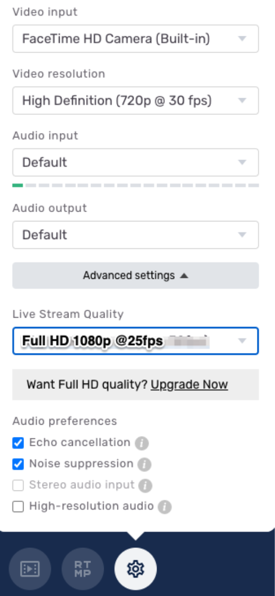

<!-- tabs:end -->

### Streamaxia (iOS and Android SDK)

?> <https://www.streamaxia.com/>

?> SRT is not supported

?> On-Prem is not supported

<!-- tabs:start -->

#### **RTMP**

| Menu Item | Property              | Value                                                                    |
| --------- | --------------------- | ------------------------------------------------------------------------ |
| Settings  | Server URL            | Ingest URL for example rtmp://ingest.liveryvideo.com/app/12a34b56c78d90e |
|           | Server Authentication | Stream Key optional value for example vYm5X669xxdk                       |
|           | Resolution            | 1920x1080                                                                |

#### **Screenshots**

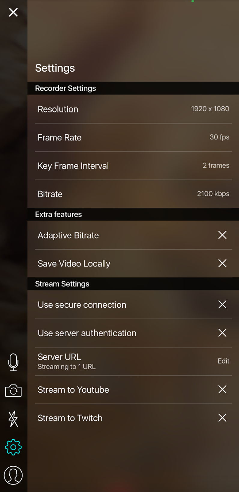

<!-- tabs:end -->

### Softvelum (iOS and Android SDK)

?> <https://softvelum.com/larix/>

?> On-Prem is not supported

<!-- tabs:start -->

#### **RTMP**

| Menu Item   | Property            | Value                                                                                                                                                |
| ----------- | ------------------- | ---------------------------------------------------------------------------------------------------------------------------------------------------- |
| Destination | URL                 | Larix requires the ingest URL and stream key to be separated. The stream ID should be removed from the Ingest URL rtmp://ingest.liveryvideo.com/app/ |
|             | Stream Key          | The Stream Key is a mandatory value in Larix the last part if the stream ID can be added as Stream Key; 12a34b56c78d90e                              |
|             | Resolution1920x1080 |
|             | Keyframe frequency  | 2 seconds                                                                                                                                            |
|             | Codec               | H264                                                                                                                                                 |

#### **SRT**

| Menu Item   | Property           | Value                                                                                                                                                                                        |
| ----------- | ------------------ | -------------------------------------------------------------------------------------------------------------------------------------------------------------------------------------------- |
| Destination | URL                | Larix requires the ingest URL and stream key to be separated. The stream ID should as well as the 'pkt_size=1316&streamid=' be removed from the Ingest URL srt://ingest.liveryvideo.com:9998 |
|             | Stream Key         | The Stream Key is a mandatory value in Larix the last part if the stream ID can be added as Stream Key; 12a34b56c78d90e                                                                      |
|             | Resolution         | 1920x1080                                                                                                                                                                                    |
|             | Keyframe frequency | 2 seconds                                                                                                                                                                                    |
|             | Codec              | H264                                                                                                                                                                                         |

#### **Screenshots**

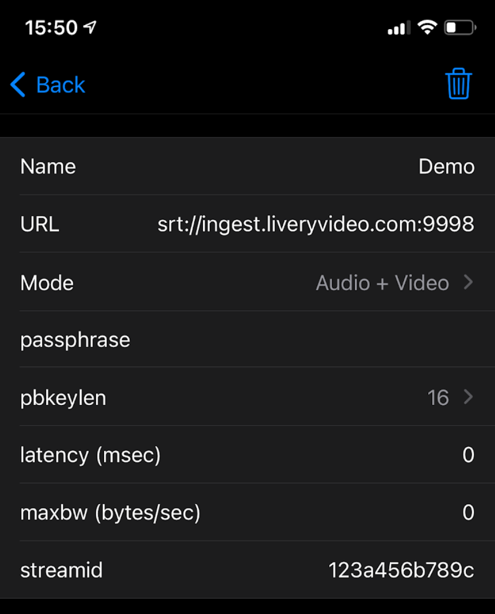

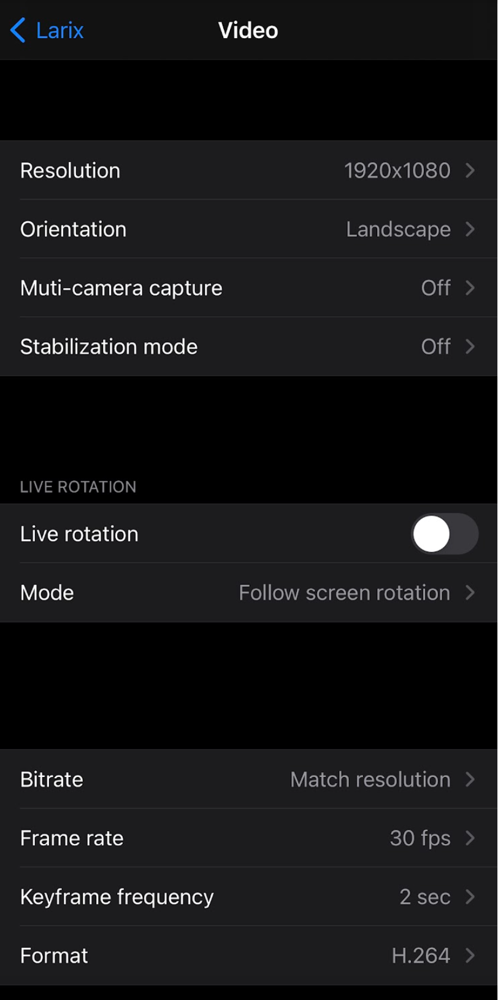

<!-- tabs:end -->

### LiveU

?> <https://www.liveu.tv/>

?> Go to <https://solo.liveu.tv/> to change any settings

<!-- tabs:start -->

#### **RTMP**

Select a custom RTMP source 

| Menu Item   | Property   | Value                                                                                                                                                |
| ----------- | ---------- | ---------------------------------------------------------------------------------------------------------------------------------------------------- |
| Destination | URL        | LiveU requires the ingest URL and stream key to be separated. The stream ID should be removed from the Ingest URL rtmp://ingest.liveryvideo.com/app/ |
|             | Stream Key | The Stream Key is a mandatory value. The last part of the URL, the stream ID, can be added as Stream Key; 12a34b56c78d90e                            |

#### **Screenshots**

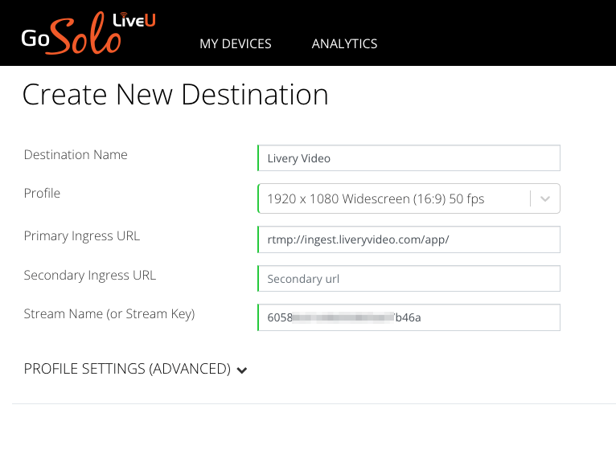

<!-- tabs:end -->

### Magewell Ultra Stream

?> <https://www.magewell.com/ultra-stream>

<!-- tabs:start -->

#### **RTMP**

Select a custom RTMP source 

| Menu Item        | Property          | Value                                                                                                                                                   |
| ---------------- | ----------------- | ------------------------------------------------------------------------------------------------------------------------------------------------------- |
| Streaming Server | URL               | Magewell requires the ingest URL and stream key to be separated. The stream ID should be removed from the Ingest URL rtmp://ingest.liveryvideo.com/app/ |
|                  | Stream Key        | The Stream Key is a mandatory value. The last part of the URL, the stream ID, can be added as Stream Key; 12a34b56c78d90e                               |
|                  | Keyframe Interval | 2 seconds                                                                                                                                               |
|                  | Codec type        | H264                                                                                                                                                    |

#### **Screenshots**

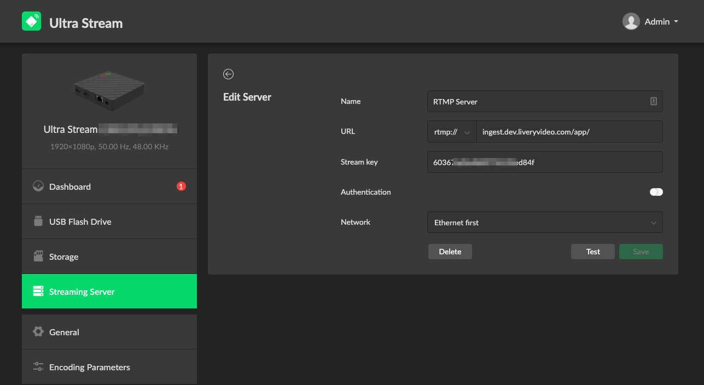

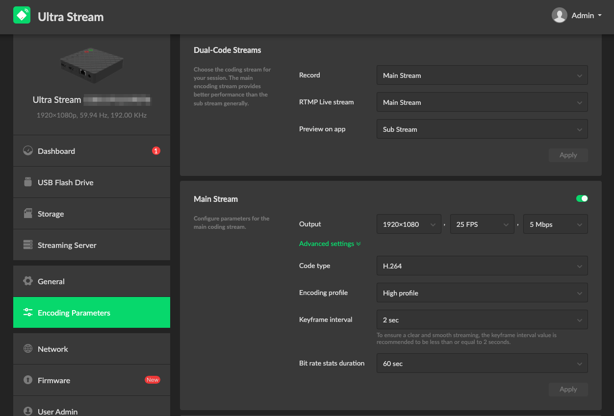

<!-- tabs:end -->

### Magewell Ultra Encode

?> <https://www.magewell.com/ultra-encode>

<!-- tabs:start -->

#### **RTMP**

Select a custom RTMP source 

| Menu Item             | Property          | Value                                                                                                                                                   |
| --------------------- | ----------------- | ------------------------------------------------------------------------------------------------------------------------------------------------------- |
| Streaming Server      | URL               | Magewell requires the ingest URL and stream key to be separated. The stream ID should be removed from the Ingest URL rtmp://ingest.liveryvideo.com/app/ |
|                       | Stream Key        | The Stream Key is a mandatory value. The last part of the URL, the stream ID, can be added as Stream Key; 12a34b56c78d90e                               |
| Encodering Parameters | Keyframe Interval | 2 seconds                                                                                                                                               |
|                       | Codec type        | H264                                                                                                                                                    |

#### **SRT**

Select a custom Caller source 

| Menu Item             | Property           | Value                                                                                                                                       |
| --------------------- | ------------------ | ------------------------------------------------------------------------------------------------------------------------------------------- |
| Streaming Server      | address            | Magewell requires the ingest URL and stream key to be separated. The stream ID should be removed from the Ingest URL ingest.liveryvideo.com |
|                       | Port               | 9998                                                                                                                                        |
|                       | Latency            | 30ms (as low as possible)                                                                                                                   |
|                       | Stream ID          | The Stream Key is a mandatory value. The last part of the URL, the stream ID, can be added as Stream Key; 12a34b56c78d90e                   |
| Encodering Parameters | Keyframe frequency | 2 seconds                                                                                                                                   |
|                       | Codec              | H264                                                                                                                                        |

#### **Screenshots**

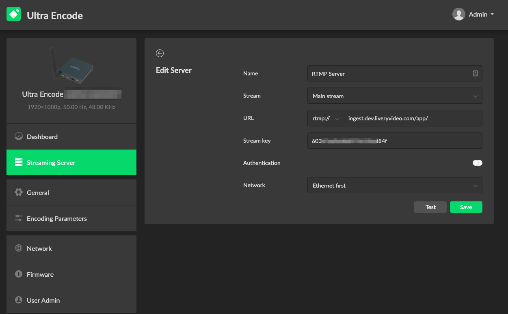

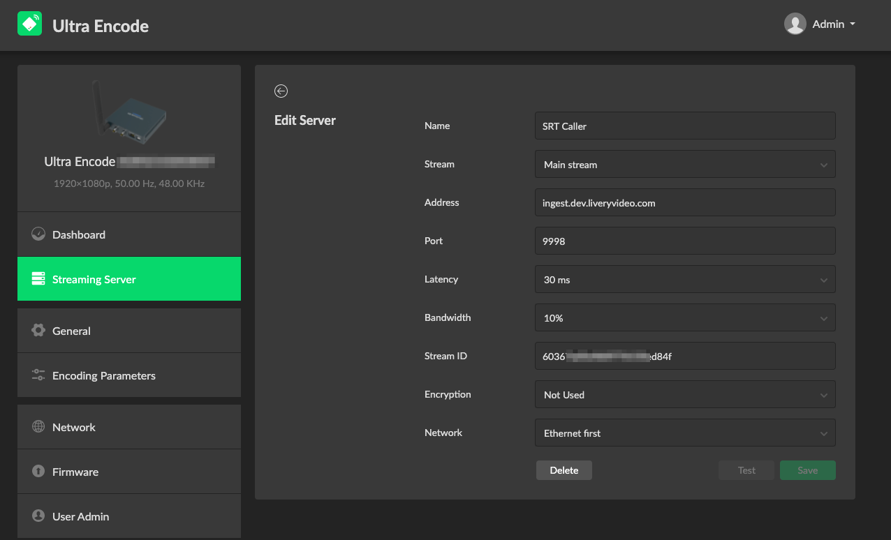

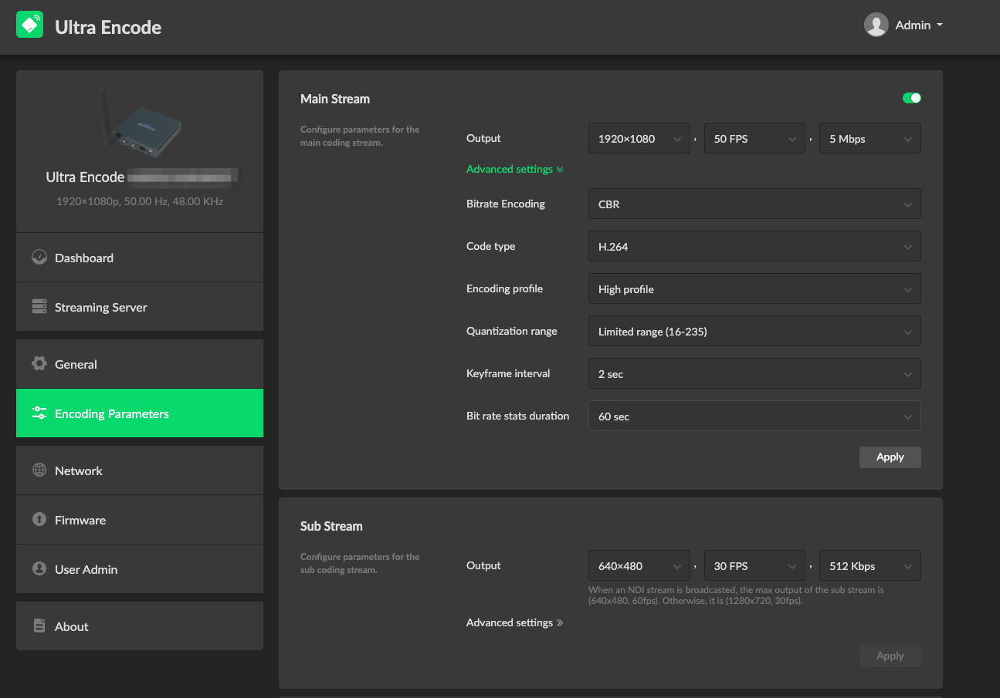

<!-- tabs:end -->

### Teradek Vidiu

?> <https://teradek.com/pages/vidiu-x>

<!-- tabs:start -->

#### **RTMP**

Select a custom RTMP source 

| Menu Item | Property               | Value                                                                                                                                                  |
| --------- | ---------------------- | ------------------------------------------------------------------------------------------------------------------------------------------------------ |
| Broadcast | Mode                   | RTMP/RTMPS                                                                                                                                             |
|           | CRTMP/RTMPS Server URL | Teradek requires the ingest URL and stream key to be separated. The stream ID should be removed from the Ingest URL rtmp://ingest.liveryvideo.com/app/ |
|           | Stream                 | The Stream Key is a mandatory value. The last part of the URL, the stream ID, can be added as Stream Key; 12a34b56c78d90e                              |

#### **Screenshots**

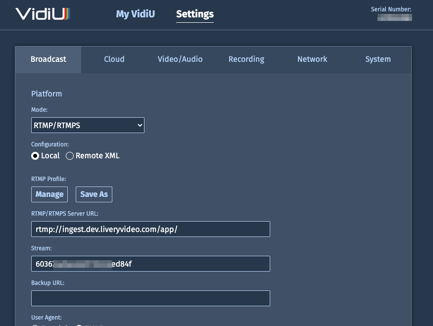

<!-- tabs:end -->

## Revision History

| Version     | Description                                                                      |
| ----------- | -------------------------------------------------------------------------------- |
| docs update | Ingest info added for LiveU, Magewell Ultra & Teradek Vidiu                      |
| 0.6.0       | Secure ingest Use audio delay setting from the backend                        |
| 0.5.0       | Added the ability to automatically update the encoder from the Management Portal |

## Q&A

**I see the video but I'm not able to get audio via the output of the computer?**

_Make sure the audio is sent along with the video single via the HDMI or SDI cable. This can be achieved via the audio output settings._

**I can hear the audio in the stream, but I’m no longer able to hear the audio via my studio headphone/speakers.**

Configure the audio settings, so the audio is played on both audio outputs. See Multi Audio output for more information.

**The cloud encoder keeps on restarting.**

_Make sure a 1080p video is ingested via the RTMP or SRT URL._

**The stream is unstable or the video buffer is low.**

_Check your internet connection; make sure the upload speed is double the combined total of the different qualities and you don't have any package loss.  <https://packetlosstest.com/> <https://www.speedtest.net/>   If possible set the encoder/mixer to “Zero Latency” in the encoder settings._

**I want to ingest in 4k to the cloud encoder (3840x2160px).**

_Please contact the Livery team to make the additional changes._

**How long does it take for a cloud stream to stop?**

Every minute the system checks if a stream is still active.
If no data has been received for a minute the stream will be stopped.
This means that a stream will stop somewhere between 1 and 2 minutes after the RTMP/SRT signal has stopped.
